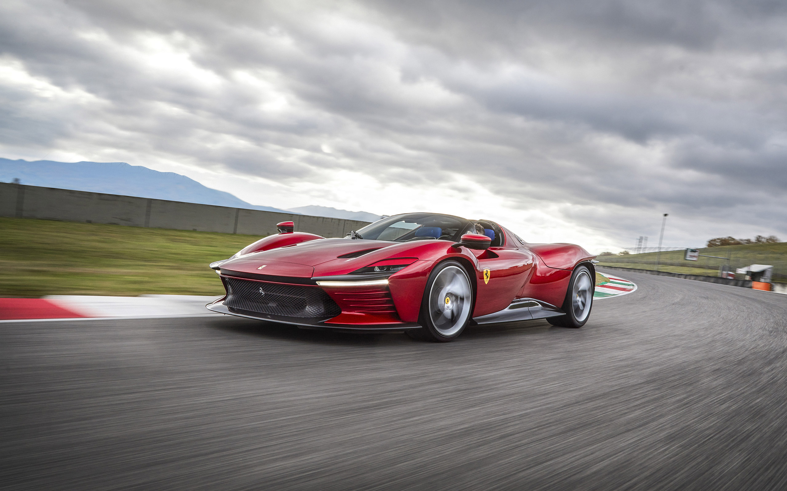
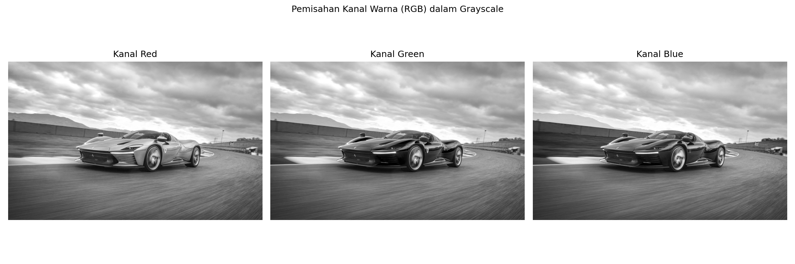
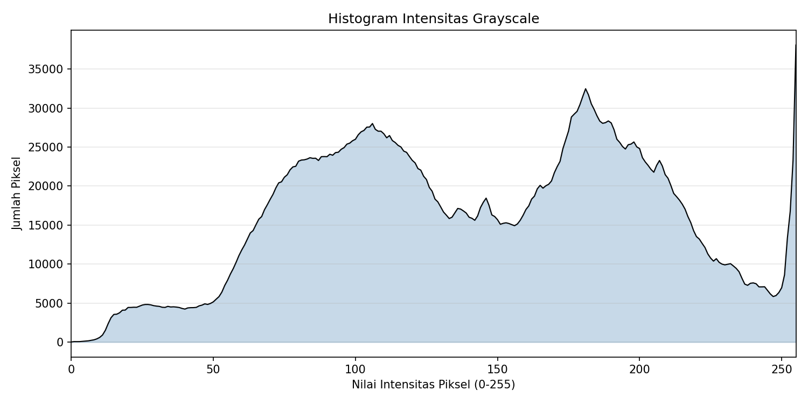

# LAPORAN TUGAS 1 — VISI KOMPUTER

---

**Mata Kuliah** : Visi Komputer  
**Tugas**       : Tugas 1 (Bagian A & B)  
**Tanggal**     : 1 Oktober 2026  
**Tools**       : Python 3.x, OpenCV, Matplotlib, NumPy  

---

## DAFTAR ISI

1. [Pendahuluan](#1-pendahuluan)  
2. [Bagian A — Perhitungan Memori & Matriks](#2-bagian-a--perhitungan-memori--matriks)  
   - 2.1 [Soal 1: Analisis Ukuran File Citra](#21-soal-1-analisis-ukuran-file-citra)  
   - 2.2 [Soal 2: Binerisasi Matriks Spasial](#22-soal-2-binerisasi-matriks-spasial)  
3. [Bagian B — Eksperimen Pemrograman Citra](#3-bagian-b--eksperimen-pemrograman-citra)  
   - 3.1 [Eksperimen 1: Pemisahan Kanal Warna](#31-eksperimen-1-pemisahan-kanal-warna)  
   - 3.2 [Eksperimen 2: Plot Histogram Intensitas](#32-eksperimen-2-plot-histogram-intensitas)  
4. [Kesimpulan](#4-kesimpulan)  
5. [Referensi](#5-referensi)  

---

## 1. Pendahuluan

### 1.1 Latar Belakang

Pengolahan citra digital merupakan salah satu bidang fundamental dalam visi komputer yang melibatkan manipulasi dan analisis gambar secara komputasional. Pemahaman tentang representasi citra dalam memori komputer — termasuk ukuran file, format warna, dan operasi dasar seperti thresholding — menjadi pondasi penting sebelum mempelajari teknik-teknik yang lebih kompleks.

Tugas ini bertujuan untuk mengasah pemahaman teoritis mengenai perhitungan memori citra serta keterampilan praktis dalam memanipulasi piksel menggunakan pustaka Python (OpenCV dan Matplotlib).

### 1.2 Tujuan

1. Memahami cara menghitung ukuran file citra mentah (uncompressed) berdasarkan resolusi dan kedalaman bit.
2. Memahami konsep binerisasi (thresholding) pada matriks spasial grayscale.
3. Mengimplementasikan pemisahan kanal warna (R, G, B) dari citra berwarna.
4. Mengimplementasikan pembuatan histogram intensitas dari citra grayscale.

### 1.3 Citra Input

Citra yang digunakan dalam eksperimen ini adalah foto **Ferrari Daytona SP3** dengan spesifikasi:

| Parameter     | Detail                                          |
|---------------|--------------------------------------------------|
| Nama File     | `2022-Ferrari-Daytona-SP3-009-1600.jpg`          |
| Resolusi      | 2560 × 1600 piksel                               |
| Jumlah Channel| 3 (RGB)                                          |
| Ukuran File   | 694,2 KB (terkompresi JPEG)                      |
| Format        | JPEG                                             |

**Gambar Citra Input:**



---

## 2. Bagian A — Perhitungan Memori & Matriks

### 2.1 Soal 1: Analisis Ukuran File Citra

> **Soal:** Hitung ukuran mentah (uncompressed) citra beresolusi **1920 × 1080 piksel** untuk:  
> a) Citra Grayscale 8-bit (dalam MB)  
> b) Citra True Color RGB 24-bit (dalam MB)

#### Dasar Teori

Ukuran file citra mentah (tanpa kompresi) dapat dihitung menggunakan rumus:

```
Ukuran (byte) = Lebar × Tinggi × Jumlah_Channel × (Bit_per_Channel / 8)
```

- **Grayscale 8-bit**: 1 channel, 8 bit per piksel → 1 byte per piksel
- **True Color RGB 24-bit**: 3 channel (Red, Green, Blue), masing-masing 8 bit → 3 byte per piksel

#### a) Citra Grayscale 8-bit

**Diketahui:**
- Resolusi: 1920 × 1080 piksel
- Kedalaman bit: 8-bit (1 byte per piksel)
- Jumlah channel: 1

**Perhitungan:**

```
Ukuran = 1920 × 1080 × 1 byte
       = 2.073.600 byte
```

**Konversi ke MB:**

```
Ukuran = 2.073.600 / (1024 × 1024)
       = 2.073.600 / 1.048.576
       = 1,977 MB
```

> **✅ Jawaban: ≈ 1,98 MB**

#### b) Citra True Color RGB 24-bit

**Diketahui:**
- Resolusi: 1920 × 1080 piksel
- Kedalaman bit: 24-bit (3 byte per piksel, yaitu 8 bit × 3 channel)
- Jumlah channel: 3 (R, G, B)

**Perhitungan:**

```
Ukuran = 1920 × 1080 × 3 byte
       = 6.220.800 byte
```

**Konversi ke MB:**

```
Ukuran = 6.220.800 / (1024 × 1024)
       = 6.220.800 / 1.048.576
       = 5,933 MB
```

> **✅ Jawaban: ≈ 5,93 MB**

#### Ringkasan Perbandingan

| Tipe Citra            | Byte/Piksel | Total Byte  | Ukuran (MB) |
|-----------------------|-------------|-------------|-------------|
| Grayscale 8-bit       | 1           | 2.073.600   | ≈ 1,98      |
| True Color RGB 24-bit | 3           | 6.220.800   | ≈ 5,93      |

> **Catatan:** Citra RGB membutuhkan memori **3× lebih besar** dibanding Grayscale karena menyimpan informasi pada 3 channel warna.

---

### 2.2 Soal 2: Binerisasi Matriks Spasial

> **Soal:** Diberikan matriks grayscale 4×4 dengan ambang batas (threshold) T = 128.  
> Tuliskan matriks biner hasil transformasi!

#### Dasar Teori

**Binerisasi (Binary Thresholding)** adalah operasi pengolahan citra yang mengubah citra grayscale menjadi citra biner (hitam-putih). Setiap piksel dibandingkan dengan nilai ambang batas (*threshold*) T:

```
f(x, y) = { 1 (putih),  jika piksel(x, y) ≥ T
           { 0 (hitam),  jika piksel(x, y) < T
```

#### Matriks Asli (Input)

```
[[ 45, 180, 200,  12],
 [ 90, 255, 128,  64],
 [130,  10, 110, 240],
 [210,  85, 150,   0]]
```

**Threshold:** T = 128

#### Proses Transformasi

Setiap elemen matriks dibandingkan dengan T = 128:

| Posisi | Nilai Asli | Kondisi (≥ 128?) | Hasil Biner |
|--------|-----------|-------------------|-------------|
| (0,0)  | 45        | 45 < 128 → Tidak  | **0**       |
| (0,1)  | 180       | 180 ≥ 128 → Ya    | **1**       |
| (0,2)  | 200       | 200 ≥ 128 → Ya    | **1**       |
| (0,3)  | 12        | 12 < 128 → Tidak  | **0**       |
| (1,0)  | 90        | 90 < 128 → Tidak  | **0**       |
| (1,1)  | 255       | 255 ≥ 128 → Ya    | **1**       |
| (1,2)  | 128       | 128 ≥ 128 → Ya    | **1**       |
| (1,3)  | 64        | 64 < 128 → Tidak  | **0**       |
| (2,0)  | 130       | 130 ≥ 128 → Ya    | **1**       |
| (2,1)  | 10        | 10 < 128 → Tidak  | **0**       |
| (2,2)  | 110       | 110 < 128 → Tidak | **0**       |
| (2,3)  | 240       | 240 ≥ 128 → Ya    | **1**       |
| (3,0)  | 210       | 210 ≥ 128 → Ya    | **1**       |
| (3,1)  | 85        | 85 < 128 → Tidak  | **0**       |
| (3,2)  | 150       | 150 ≥ 128 → Ya    | **1**       |
| (3,3)  | 0         | 0 < 128 → Tidak   | **0**       |

#### Matriks Biner Hasil Transformasi

```
[[0, 1, 1, 0],
 [0, 1, 1, 0],
 [1, 0, 0, 1],
 [1, 0, 1, 0]]
```

> **✅ Jawaban:** Matriks biner di atas merupakan hasil transformasi thresholding dengan T = 128.  
> Dari 16 piksel total: **8 piksel bernilai 1** (putih) dan **8 piksel bernilai 0** (hitam).

---

## 3. Bagian B — Eksperimen Pemrograman Citra

> **Instruksi:** Implementasi manipulasi piksel menggunakan Python (OpenCV/Matplotlib)

### 3.1 Eksperimen 1: Pemisahan Kanal Warna

#### Tujuan

Memuat sebuah citra berwarna, lalu menampilkan 3 sub-plot terpisah untuk kanal **Red**, **Green**, dan **Blue** dalam bentuk grayscale.

#### Kode Program

```python
import cv2
import matplotlib.pyplot as plt

# Muat citra berwarna
img = cv2.imread(r'D:\Tugas Kuliah\Visi Komputer\2022-Ferrari-Daytona-SP3-009-1600.jpg')

# OpenCV membaca dalam format BGR, konversi ke RGB untuk matplotlib
img_rgb = cv2.cvtColor(img, cv2.COLOR_BGR2RGB)

# Pisahkan kanal warna
R = img_rgb[:, :, 0]  # Kanal Red
G = img_rgb[:, :, 1]  # Kanal Green
B = img_rgb[:, :, 2]  # Kanal Blue

# Tampilkan 3 sub-plot
fig, axes = plt.subplots(1, 3, figsize=(15, 5))

axes[0].imshow(R, cmap='gray')
axes[0].set_title('Kanal Red')
axes[0].axis('off')

axes[1].imshow(G, cmap='gray')
axes[1].set_title('Kanal Green')
axes[1].axis('off')

axes[2].imshow(B, cmap='gray')
axes[2].set_title('Kanal Blue')
axes[2].axis('off')

plt.suptitle('Pemisahan Kanal Warna (RGB) dalam Grayscale')
plt.tight_layout()
plt.savefig('output_kanal_warna.png', dpi=150)
plt.show()
```

#### Penjelasan Kode

1. **`cv2.imread()`** — Membaca file gambar ke dalam array NumPy. OpenCV membaca dalam urutan BGR (Blue-Green-Red).
2. **`cv2.cvtColor(..., cv2.COLOR_BGR2RGB)`** — Mengonversi urutan channel dari BGR ke RGB agar sesuai dengan konvensi Matplotlib.
3. **`img_rgb[:, :, 0]`** — Mengekstrak channel pertama (Red) menggunakan slicing array NumPy. Indeks 0 = Red, 1 = Green, 2 = Blue.
4. **`imshow(..., cmap='gray')`** — Menampilkan masing-masing channel sebagai gambar grayscale. Area yang terang menunjukkan intensitas tinggi pada channel tersebut.

#### Hasil Output



#### Analisis Hasil

| Kanal   | Observasi |
|---------|-----------|
| **Red** | Bagian bodi mobil Ferrari (berwarna merah) tampak **lebih terang** karena memiliki nilai intensitas Red yang tinggi. Area langit dan aspal cenderung lebih gelap. |
| **Green** | Distribusi intensitas lebih merata. Area rumput/vegetasi di latar belakang terlihat **lebih terang** karena memiliki komponen hijau yang dominan. |
| **Blue** | Area **langit dan awan** tampak paling terang pada channel ini karena langit memiliki komponen biru yang tinggi. Bodi mobil merah tampak sangat gelap. |

> **Insight:** Pemisahan kanal warna memungkinkan kita melihat kontribusi masing-masing komponen warna. Objek berwarna merah (mobil) memiliki intensitas tinggi di channel Red dan rendah di channel Blue, sesuai dengan teori ruang warna RGB.

---

### 3.2 Eksperimen 2: Plot Histogram Intensitas

#### Tujuan

Mengonversi citra ke format Grayscale, kemudian membuat plot histogram distribusi kecerahan piksel (rentang 0–255).

#### Kode Program

```python
import cv2
import matplotlib.pyplot as plt
import numpy as np

# Muat citra berwarna
img = cv2.imread(r'D:\Tugas Kuliah\Visi Komputer\2022-Ferrari-Daytona-SP3-009-1600.jpg')

# Konversi ke Grayscale
gray = cv2.cvtColor(img, cv2.COLOR_BGR2GRAY)

# Hitung histogram
histogram = cv2.calcHist([gray], [0], None, [256], [0, 256])

# Plot histogram
plt.figure(figsize=(10, 5))
plt.plot(histogram, color='black', linewidth=1)
plt.fill_between(range(256), histogram.flatten(), alpha=0.3, color='steelblue')
plt.title('Histogram Intensitas Grayscale')
plt.xlabel('Nilai Intensitas Piksel (0-255)')
plt.ylabel('Jumlah Piksel')
plt.xlim([0, 255])
plt.grid(axis='y', alpha=0.3)
plt.tight_layout()
plt.savefig('output_histogram.png', dpi=150)
plt.show()
```

#### Penjelasan Kode

1. **`cv2.cvtColor(..., cv2.COLOR_BGR2GRAY)`** — Mengonversi citra berwarna (3 channel) menjadi grayscale (1 channel) menggunakan rumus luminansi: `Gray = 0.299×R + 0.587×G + 0.114×B`.
2. **`cv2.calcHist([gray], [0], None, [256], [0, 256])`** — Menghitung histogram dengan parameter:
   - `[gray]`: citra input
   - `[0]`: channel yang dihitung (channel 0)
   - `None`: tanpa mask (hitung seluruh gambar)
   - `[256]`: jumlah bin (0 sampai 255)
   - `[0, 256]`: rentang nilai piksel
3. **`plt.fill_between()`** — Membuat area shading di bawah kurva histogram untuk visualisasi yang lebih informatif.

#### Hasil Output



#### Analisis Hasil

Histogram menunjukkan distribusi **bimodal** (dua puncak utama):

| Rentang Intensitas | Jumlah Piksel | Interpretasi |
|--------------------|---------------|-------------|
| **0–50** (sangat gelap) | Rendah | Hanya sedikit area yang sangat gelap (bayangan ekstrem) |
| **60–130** (gelap–sedang) | **Tinggi** (puncak ~28.000) | Area aspal sirkuit, bodi hitam mobil, ban, dan bayangan |
| **130–160** (sedang) | Sedang (~15.000–18.000) | Area transisi antara objek gelap dan terang |
| **170–200** (terang) | **Tinggi** (puncak ~32.500) | Awan, langit cerah, dan area reflektif pada bodi mobil |
| **200–240** (sangat terang) | Menurun (~10.000–23.000) | Area terang pada awan dan pantulan cahaya |
| **250–255** (putih maksimal) | **Sangat Tinggi** (spike >35.000) | Lonjakan tajam yang mengindikasikan adanya *highlight clipping*, yaitu area yang sangat terang hingga mencapai nilai piksel maksimum (saturasi putih), kemungkinan berasal dari pantulan cahaya matahari pada bodi mobil atau bagian awan yang sangat terang |

> **Insight:** Distribusi bimodal mengindikasikan citra memiliki kontras yang baik dengan dua kelompok dominan, yaitu area gelap (foreground: mobil & aspal) dan area terang (background: langit & awan). Namun, lonjakan tajam di ujung kanan histogram (intensitas 250–255) menunjukkan adanya *highlight clipping*, di mana sejumlah besar piksel mencapai nilai maksimum sehingga detail pada area tersebut hilang akibat overexposure pada bagian tertentu dari citra.

---

## 4. Kesimpulan

Berdasarkan pelaksanaan Tugas 1, dapat disimpulkan bahwa ukuran file citra digital berbanding lurus dengan resolusi dan kedalaman bit yang digunakan. Citra RGB 24-bit membutuhkan memori tiga kali lebih besar dibanding Grayscale 8-bit pada resolusi yang sama, yaitu 5,93 MB berbanding 1,98 MB untuk resolusi 1920×1080. Selain itu, operasi binerisasi (thresholding) terbukti mampu mengubah citra grayscale menjadi citra biner secara efektif dengan membandingkan setiap piksel terhadap nilai ambang batas tertentu, di mana pemilihan nilai threshold yang tepat sangat menentukan hasil segmentasi yang dihasilkan.

Pada bagian eksperimen pemrograman, pemisahan kanal warna menunjukkan bahwa setiap channel RGB menyimpan informasi intensitas yang berbeda-beda. Objek dengan warna dominan tertentu akan tampak lebih terang pada channel yang sesuai, seperti bodi mobil Ferrari yang berwarna merah tampak lebih terang pada channel Red namun sangat gelap pada channel Blue. Sementara itu, analisis histogram intensitas grayscale pada citra Ferrari Daytona SP3 menghasilkan distribusi bimodal dengan dua puncak utama yang mengindikasikan adanya kontras tinggi antara objek foreground yang gelap (mobil dan aspal) dengan background yang terang (langit dan awan). Selain itu, ditemukan lonjakan tajam pada intensitas 250–255 yang menunjukkan adanya highlight clipping akibat overexposure pada area tertentu seperti pantulan cahaya matahari pada bodi mobil dan bagian awan yang sangat terang.

---

## 5. Referensi

1. Gonzalez, R. C., & Woods, R. E. (2018). *Digital Image Processing* (4th ed.). Pearson.
2. OpenCV Documentation. *Image Processing in OpenCV*. https://docs.opencv.org/4.x/d2/d96/tutorial_py_table_of_contents_imgproc.html
3. Matplotlib Documentation. *Pyplot Tutorial*. https://matplotlib.org/stable/tutorials/pyplot.html
4. Szeliski, R. (2022). *Computer Vision: Algorithms and Applications* (2nd ed.). Springer.

---

> **File pendukung:**
> - `soal_b1_kanal_warna.py` — Script pemisahan kanal warna
> - `soal_b2_histogram.py` — Script histogram intensitas
> - `output_kanal_warna.png` — Hasil output pemisahan kanal warna
> - `output_histogram.png` — Hasil output histogram intensitas
> - `2022-Ferrari-Daytona-SP3-009-1600.jpg` — Citra input
